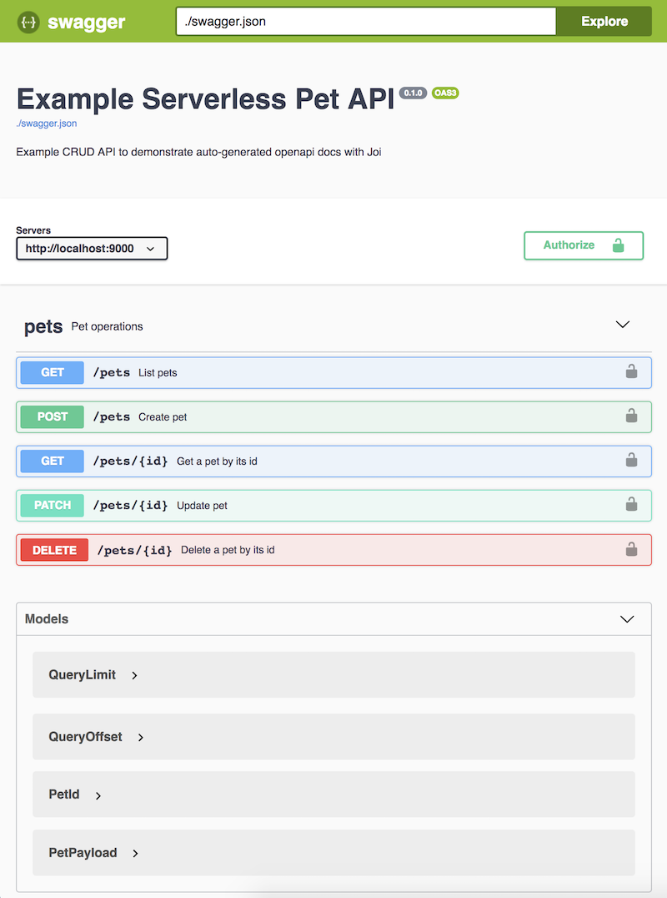

# Serverless OpenAPI Joi Plugin
[](http://anttiviljami.mit-license.org)

Serverless plugin for creating OpenAPI specifications with Joi validation.

## Quick Start

In your serverless.yml:

```yaml
plugins:
  - serverless-openapi-joi

functions:
  api:
    handler: index.handler
    events:
      - http:
          path: swagger.json
          method: get
          private: true
      - http:
          path: pets
          method: get
          private: true
      - http:
          path: pets/{id}
          method: get
          private: true
      - http:
          path: pets
          method: post
          private: true
      - http:
          path: pets/{id}
          method: patch
          private: true
      - http:
          path: pets/{id}
          method: delete
          private: true
```

In your Serverless API handler:

```typescript
import OpenAPIHandler from 'serverless-openapi-joi/handler';

const openapi = new OpenAPIHandler({
  title: 'Example CRUD Pet API',
  description: 'Example CRUD API to demonstrate auto-generated openapi docs with Joi',
  version: '0.1.0',
  baseurl: process.env.BASEURL,
  routes,
});

export async function handler(event) {
  return openapi.handler(event);
}
```

Validation models are defined using Joi:

```typescript
import Joi from 'joi';

const validation = {
  petId: Joi.number().integer()
    .description('Unique identifier for pet in database')
    .example(1)
    .label('PetId'),

  petPayload: Joi.object({
    name: Joi.string()
      .description('Name of the pet')
      .example('Garfield')
      .label('PetName'),
  }).label('PetPayload'),

  limit: Joi.number().integer().positive()
    .description('Number of items to return')
    .example(25)
    .label('QueryLimit'),

  offset: Joi.number().integer().min(0)
    .description('Starting offset for returning items')
    .example(0)
    .label('QueryOffset'),
};
```

Routes define API operations using validation rules for request body, path parameters, query parameters and headers.

```typescript
const routes = [
  {
    method: 'GET',
    path: '/pets',
    handler: getPets,
    summary: 'List pets',
    description: 'Returns all pets in database',
    tags: ['pets'],
    validation: {
      queryStringParameters: {
        limit: validation.limit,
        offset: validation.offset,
      },
    },
    responses: {
      200: { description: 'List of pets in database' },
    },
  },
  {
    method: 'GET',
    path: '/pets/{id}',
    handler: getPetById,
    summary: 'Get a pet by its id',
    description: 'Returns a pet by its id in database',
    tags: ['pets'],
    validation: {
      pathParameters: {
        id: validation.petId,
      },
    },
    responses: {
      200: { description: 'Pet object corresponding to id' },
      404: { description: 'Pet not found' },
    },
  },
  {
    method: 'POST',
    path: '/pets',
    handler: createPet,
    summary: 'Create pet',
    description: 'Crete a new pet into the database',
    tags: ['pets'],
    validation: {
      payload: validation.petPayload,
    },
    responses: {
      201: { description: 'Pet created succesfully' },
    },
  },
  {
    method: 'PATCH',
    path: '/pets/{id}',
    handler: updatePetById,
    summary: 'Update pet',
    description: 'Update an existing pet in the database',
    tags: ['pets'],
    validation: {
      pathParameters: {
        id: validation.petId,
      },
      payload: validation.petPayload,
    },
    responses: {
      200: { description: 'Pet updated succesfully' },
      404: { description: 'Pet not found' },
    },
  },
  {
    method: 'DELETE',
    path: '/pets/{id}',
    handler: deletePetById,
    summary: 'Delete a pet by its id',
    description: 'Deletes a pet by its id in database',
    tags: ['pets'],
    validation: {
      pathParameters: {
        id: validation.petId,
      },
    },
    responses: {
      200: { description: 'Pet deleted succesfully' },
      404: { description: 'Pet not found' },
    },
  },
];
```

OpenAPI v3 docs including JSON schema models are automatically generated for API, which can be viewed with tools like
Swagger UI. You can use either the generated static Swagger UI documentation page, or the `/swagger.json` endpoint.



